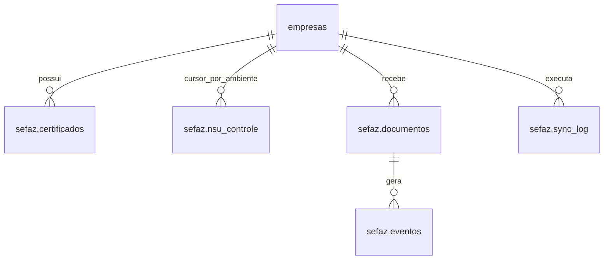

# Sincronização SEFAZ — NFeDistribuicaoDFe

## Contexto

Pedido: módulo que, para cada empresa com certificado digital A1 ativo, roda diariamente
(Celery beat) uma consulta incremental por NSU no Ambiente Nacional (`distDFeInt`), baixa
documentos novos (emitidos e recebidos pelo CNPJ da empresa), armazena de forma auditável e
disponibiliza no Painel com apoio à Manifestação do Destinatário. Trabalho em 3 fases —
banco → backend → frontend — cada uma parada para validação antes da próxima.

Biblioteca de assinatura/SOAP decidida em `docs/adr/0001-sefaz-distribuicao-dfe-biblioteca.md`:
`nfelib` + `erpbrasil.assinatura` + `erpbrasil.edoc`, encapsuladas atrás de um único ponto de
acesso (`distribuicao_dfe_client.py`), gateway pago descartado para este ciclo.

## Achados que mudam o pedido original

- **`empresas.id` é `BIGINT`/`BIGSERIAL`, não UUID.** Todas as FKs e PKs novas seguem esse
  tipo — é o padrão de 100% do schema atual, inclusive `conta_azul.*`. `empresa_id` (UUID) da
  Plataforma-Matriz não é a mesma coisa que `empresas.id` neste banco; não confundir os dois.
- **Schema dedicado, não prefixo de tabela.** Precedente é `conta_azul.integracoes` (schema
  próprio no mesmo banco de `empresas`, nomes de tabela curtos, sem prefixo redundante). Este
  módulo usa schema `sefaz`: `sefaz.certificados`, `sefaz.nsu_controle`, `sefaz.documentos`,
  `sefaz.eventos`, `sefaz.sync_log` — não `public.sefaz_*` como pedido originalmente.
- **`API/integracoes/conta_azul/` não é o padrão a copiar.** É uma pasta legada com `.venv`
  própria e `sys.path` hack pra plugar no FastAPI principal — reflexo de como o Conta Azul
  começou como CLI standalone. O módulo SEFAZ nasce direto em `API/app/` (api/services/
  repositories/domain/workers), sem pasta externa, sem hack de import.
- **Já existe mapeamento anterior do mesmo problema**: `docs/mapeamento-busca-xml-sefaz.md`
  (2026-05-08), em escopo menor — sem Manifestação do Destinatário, sem tela própria, cliente
  encapsulado sem lib fiscal pronta, reaproveitando o staging `notas_xml_importados` pro
  processamento (`ProcessarNFeService`). O escopo atual é maior e desacoplado: o módulo SEFAZ
  fica com sua própria tabela de documentos e não escreve em `notas_xml_importados` — reagir a
  documento novo no módulo fiscal/NCM fica pra depois, via evento Celery (conforme já pedido).
  As regras de negócio desse mapeamento (janela de espera em `cStat=137`, bloqueio em
  `cStat=656`, referências oficiais) são reaproveitadas na Fase 2.
- **Sem `{empresa_id}` no path das rotas.** O pedido original tinha `GET /certificados/{empresa_id}`
  e `POST /sync/{empresa_id}`. Todas as rotas fiscais do projeto resolvem a empresa pela sessão
  autenticada (`Depends(require_company_scope)`), sem aceitar um id arbitrário de outra empresa
  no path — evita reabrir a lacuna de IDOR que `docs/security.md` já lista como risco em rotas
  antigas de análise NFe. Rotas ficam `POST /api/sefaz/certificados`, `POST /api/sefaz/sync`,
  etc., sempre operando sobre `current_user.empresa_id`.
- **Não existe página "Integrações" hoje.** O Conta Azul entrou como Card dentro de
  `Configuracoes.tsx`, não como área própria. O módulo SEFAZ tem 3 telas (certificado,
  documentos, log de sync) — grande demais pra um Card. Proposta (confirmar na Fase 3): rota
  própria `/integracoes/sefaz` com sub-abas, referenciada a partir de um novo Card "SEFAZ" em
  `Configuracoes.tsx` (mesma entrada visual do Conta Azul) que leva pra lá.
- **CNPJ alfanumérico (NT 2026.004, vigente desde 2026-07-31)**: todo campo de CNPJ nas
  tabelas novas é `VARCHAR(20)` (mesmo tamanho de `empresas.cnpj`/`login.cnpj`), nunca
  numérico. `chave_acesso` continua `VARCHAR(44)` — o formato da chave de acesso da NF-e em si
  não muda com a NT, só o CNPJ embutido nela passa a poder ter letras.

## Fase 1 — Banco de dados

### Migration (schema `sefaz`, banco NFe — mesmo de `public.empresas`)

```sql
CREATE SCHEMA IF NOT EXISTS sefaz;

CREATE TABLE sefaz.certificados (
    id BIGSERIAL PRIMARY KEY,
    empresa_id BIGINT NOT NULL REFERENCES public.empresas(id) ON DELETE CASCADE,
    arquivo_certificado BYTEA NOT NULL,       -- .pfx/.p12 cifrado com Fernet
    senha_criptografada TEXT NOT NULL,        -- senha do certificado cifrada com Fernet
    cnpj_titular VARCHAR(20) NOT NULL,
    data_validade DATE NOT NULL,
    ativo BOOLEAN NOT NULL DEFAULT TRUE,
    criado_em TIMESTAMPTZ NOT NULL DEFAULT now(),
    atualizado_em TIMESTAMPTZ NOT NULL DEFAULT now()
);
-- só um certificado ativo por empresa por vez; histórico de certificados antigos é preservado
CREATE UNIQUE INDEX uq_sefaz_certificados_empresa_ativo
    ON sefaz.certificados (empresa_id) WHERE ativo;

CREATE TABLE sefaz.nsu_controle (
    id BIGSERIAL PRIMARY KEY,
    empresa_id BIGINT NOT NULL REFERENCES public.empresas(id) ON DELETE CASCADE,
    ambiente SMALLINT NOT NULL,               -- 1 producao, 2 homologacao
    ultimo_nsu VARCHAR(15) NOT NULL DEFAULT '000000000000000',
    ultima_execucao_em TIMESTAMPTZ,
    status_ultima_execucao VARCHAR(20),       -- sucesso|erro|parcial
    CONSTRAINT uq_sefaz_nsu_controle_empresa_ambiente UNIQUE (empresa_id, ambiente)
);

CREATE TABLE sefaz.documentos (
    id BIGSERIAL PRIMARY KEY,
    empresa_id BIGINT NOT NULL REFERENCES public.empresas(id) ON DELETE CASCADE,
    chave_acesso VARCHAR(44) NOT NULL,
    tipo_documento VARCHAR(20) NOT NULL,      -- resNFe|resEvento|nfeProc
    direcao VARCHAR(10) NOT NULL,             -- emitida|recebida
    cnpj_emitente VARCHAR(20) NOT NULL,
    cnpj_destinatario VARCHAR(20),
    nsu VARCHAR(15) NOT NULL,
    data_emissao TIMESTAMPTZ,
    valor_total NUMERIC(18,2),
    situacao VARCHAR(20),                     -- autorizada|cancelada|denegada
    xml_armazenado BYTEA,                     -- XML completo gzip, nulo se so resumo
    manifestacao_status VARCHAR(20),          -- pendente|ciencia|confirmada|desconhecida|nao_realizada
    criado_em TIMESTAMPTZ NOT NULL DEFAULT now(),
    atualizado_em TIMESTAMPTZ NOT NULL DEFAULT now(),
    CONSTRAINT uq_sefaz_documentos_empresa_chave UNIQUE (empresa_id, chave_acesso)
);
CREATE INDEX ix_sefaz_documentos_empresa_situacao ON sefaz.documentos (empresa_id, situacao);
CREATE INDEX ix_sefaz_documentos_manifestacao_pendente
    ON sefaz.documentos (empresa_id) WHERE manifestacao_status = 'pendente';

CREATE TABLE sefaz.eventos (
    id BIGSERIAL PRIMARY KEY,
    documento_id BIGINT NOT NULL REFERENCES sefaz.documentos(id) ON DELETE CASCADE,
    empresa_id BIGINT NOT NULL REFERENCES public.empresas(id) ON DELETE CASCADE,
    tipo_evento VARCHAR(30) NOT NULL,         -- cancelamento|carta_correcao|manifestacao_ciencia|...
    protocolo VARCHAR(20),
    status VARCHAR(20) NOT NULL,
    payload_xml TEXT,
    criado_em TIMESTAMPTZ NOT NULL DEFAULT now()
);
CREATE INDEX ix_sefaz_eventos_documento ON sefaz.eventos (documento_id);

CREATE TABLE sefaz.sync_log (
    id BIGSERIAL PRIMARY KEY,
    empresa_id BIGINT NOT NULL REFERENCES public.empresas(id) ON DELETE CASCADE,
    iniciado_em TIMESTAMPTZ NOT NULL,
    finalizado_em TIMESTAMPTZ,
    documentos_novos INT NOT NULL DEFAULT 0,
    nsu_inicial VARCHAR(15),
    nsu_final VARCHAR(15),
    status VARCHAR(20) NOT NULL,              -- sucesso|erro|timeout
    erro_detalhe TEXT
);
CREATE INDEX ix_sefaz_sync_log_empresa ON sefaz.sync_log (empresa_id, iniciado_em DESC);
```

Downgrade: `DROP SCHEMA sefaz CASCADE` (mesmo padrão de `conta_azul`).

Sem models SQLAlchemy — o projeto não usa ORM (`docs/backend-architecture.md`); acesso é
`psycopg` raw SQL em `repositories/sefaz/*`, migration com `op.execute("""SQL""")`.

### Diagrama



### Entregável Fase 1

Migration Alembic (`API/app/alembic/versions/<timestamp>_00XX_sefaz_schema.py`) com o SQL
acima. Sem código de aplicação ainda. Parar aqui pra validação.

## Fase 2 — Backend (FastAPI + Celery)

### Estrutura

```
API/app/domain/sefaz/
    cstat_rules.py                 # interpreta cStat (137 = nada novo, 656 = bloqueio) e decide
                                    # se continua paginando ou aplica janela de espera; puro, sem I/O
    doc_parser.py                  # resNFe/resEvento/nfeProc -> dataclass; calcula `direcao`
                                    # comparando cnpj_emitente x cnpj da empresa; puro, sem I/O
API/app/services/sefaz/
    crypto_service.py              # Fernet encrypt/decrypt do .pfx e da senha (chave própria
                                    # SEFAZ_CERT_ENCRYPTION_KEY, nunca reaproveita a do Conta Azul)
    certificado_service.py         # upload, validação de validade/senha, descriptografia sob demanda
    distribuicao_dfe_client.py     # UNICO lugar que importa nfelib/erpbrasil.* (ADR 0001);
                                    # monta distDFeInt, assina, envia, decompacta (gzip+base64)
    sefaz_distribuicao_service.py  # orquestra: le ultimo_nsu, chama o client, usa doc_parser,
                                    # persiste via repositories, usa cstat_rules pra decidir
                                    # se pagina de novo, atualiza nsu_controle
    manifestacao_destinatario_service.py  # envia evento de manifestação; sinaliza documento
                                    # perto do prazo sem manifestação (texto template-based,
                                    # nunca via LLM -- auditabilidade)
API/app/repositories/sefaz/
    certificados_repository.py
    nsu_controle_repository.py
    documentos_repository.py
    eventos_repository.py
    sync_log_repository.py
API/app/workers/sefaz_tasks.py     # sefaz_sync_diario (beat) + sefaz_sync_empresa (retry/backoff)
API/app/api/sefaz/routes.py
API/app/alembic/versions/<timestamp>_00XX_sefaz_schema.py   # (Fase 1)
```

### Rotas (`router = APIRouter(prefix="/sefaz", dependencies=[Depends(require_company_scope)])`)

Todas operam sobre `current_user.empresa_id` — sem `{empresa_id}` no path (ver "Achados").

| Método | Rota | Ação |
|---|---|---|
| POST | `/api/sefaz/certificados` | upload multipart (arquivo + senha), valida e cifra |
| GET | `/api/sefaz/certificados/status` | validade, dias restantes, ativo/inativo — nunca a senha |
| POST | `/api/sefaz/sync` | dispara `sefaz_sync_empresa_task.apply_async`, retorna 202 |
| GET | `/api/sefaz/documentos` | paginado, filtros: direcao, periodo, situacao, manifestacao pendente |
| GET | `/api/sefaz/documentos/{id}` | detalhe + XML se armazenado (id valida `empresa_id` do dono) |
| POST | `/api/sefaz/documentos/{id}/manifestacao` | envia manifestação (ciência/confirmação/desconhecimento/não realizada) |
| GET | `/api/sefaz/sync-log` | histórico paginado de execuções |

`GET /documentos/{id}` e `POST /documentos/{id}/manifestacao` devem validar que o documento
pertence a `current_user.empresa_id` antes de retornar/agir (`404` se não pertence, nunca
vazar existência de documento de outra empresa — mesmo princípio de `docs/security.md`).

### Celery

- Fila nova `sefaz` (soma às existentes `default`/`nfe`/`sped`/`conta_azul`).
- `sefaz_sync_diario` (beat, uma vez ao dia): itera empresas com `sefaz.certificados` ativo e
  válido, dispara `sefaz_sync_empresa_task.apply_async(args=[empresa_id], queue="sefaz")` por
  empresa — uma task por empresa pra falha de uma não travar as outras.
- `sefaz_sync_empresa_task`: chama `SefazDistribuicaoService`, que pagina pelo NSU dentro da
  mesma execução até não sobrar novidade (`cStat=137`) ou até um teto de 20 iterações (padrão
  de 50 documentos por resposta = até 1000 documentos por execução antes de esperar o próximo
  dia). Em `cStat=656`, grava bloqueio em `nsu_controle.status_ultima_execucao='erro'` e não
  tenta de novo antes da janela de espera. `autoretry_for=(ConnectionError, TimeoutError)`
  com backoff, mesmo padrão de `nfe_tasks`. Cada execução grava uma linha em `sefaz.sync_log`.

### Segurança

- JWT/`empresa_id` validado em toda rota via `require_company_scope`, mesmo padrão do resto.
- Certificado e senha nunca aparecem em log ou resposta de API (nem em erro) — mensagens de
  erro do `certificado_service`/`distribuicao_dfe_client` nunca ecoam o payload original.
- XML completo de terceiro (fornecedor/cliente) nunca vai pra log — só metadados (`chave_acesso`,
  `nsu`, `situacao`) em log estruturado.
- Ao persistir documento novo, `sefaz_distribuicao_service` publica evento Celery (canal
  interno já usado no projeto) pra permitir que o módulo fiscal/NCM reaja no futuro — sem
  acoplar agora, só o hook.

### Testes

Unitários dos services principais com o webservice SEFAZ mockado na fronteira do
`distribuicao_dfe_client` (nunca rede real) — mesmo padrão dos testes do Conta Azul: repository/
service substituído no ponto de uso via `monkeypatch.setattr`. Casos: parsing de `resNFe`/
`resEvento`, regra de `cStat` 137/656, paginação até o teto de 20 iterações, cálculo de
`direcao`, idempotência por `chave_acesso` (reprocessar o mesmo NSU não duplica documento).

### Entregável Fase 2

Services, repositories, tasks Celery, rotas, testes unitários. Parar aqui pra validação antes
do frontend.

## Fase 3 — Frontend

Estrutura (`Painel/src/features/integracoes-sefaz/`, seguindo `docs/frontend.md`):

```
components/
    CertificadoCard.tsx        # upload, status validade/dias restantes, alerta <30 dias
    DocumentosTable.tsx        # paginado, filtros direcao/periodo/situacao/manifestacao pendente
    ManifestacaoDialog.tsx     # ação de manifestação (ciência/confirmação/desconhecimento/não realizada)
    SyncLogTable.tsx           # histórico de execuções diárias
hooks/
    useSefazPageData.ts        # único lugar com lógica/estado, reaproveita useProcessingJobFlow
                                # pro polling do sync manual (mesmo hook usado em import XML/SPED)
helpers/
types.ts
```

`Painel/src/services/sefaz.api.ts` sobre `apiFetch` (nunca `fetch` direto). Rota
`/integracoes/sefaz` registrada em `App.tsx` dentro de `MainLayout`; entrada a partir de um
Card "SEFAZ" em `Configuracoes.tsx` (mesmo padrão visual do Card Conta Azul) que linka pra lá —
a confirmar no início da Fase 3, já que hoje não existe área "Integrações" separada.

### Entregável Fase 3

Componentes consumindo os endpoints da Fase 2, design system existente (Radix/shadcn,
`components/ui/` sem edição direta).

## Fora de escopo (deste ciclo)

- Integração automática do documento novo com o pipeline de KPI existente
  (`notas_xml_importados`/`ProcessarNFeService`) — fica só o hook de evento Celery, reação
  fica pra um ciclo futuro.
- NFSe municipal — `NFeDistribuicaoDFe` cobre só NF-e e eventos de interesse.
- Gateway pago (opção D do ADR 0001) — revisitar se custo/volume da opção B não compensar.
- Certificado A3 (token/HSM) — só A1 neste ciclo, conforme pedido original.

## Riscos

- Certificado e senha são dado extremamente sensível — criptografia em repouso (Fernet),
  nunca log, nunca resposta de API.
- SEFAZ pode bloquear CNPJ por uso indevido (`cStat=656`) — respeitar janela de espera é
  obrigatório, não best-effort.
- Sem Manifestação do Destinatário em alguns cenários, XML completo não libera — módulo já
  nasce com o fluxo de manifestação, não como afterthought.
- Biblioteca terceira (ADR 0001) é ponto único de acoplamento externo — mitigado por ficar
  atrás de `distribuicao_dfe_client.py`, isolado do resto do domínio.
